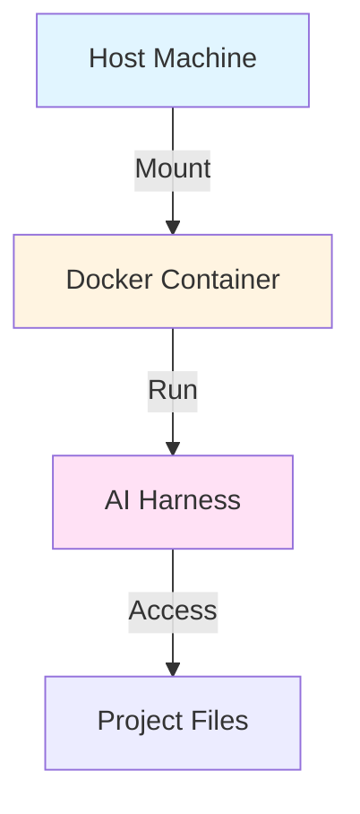
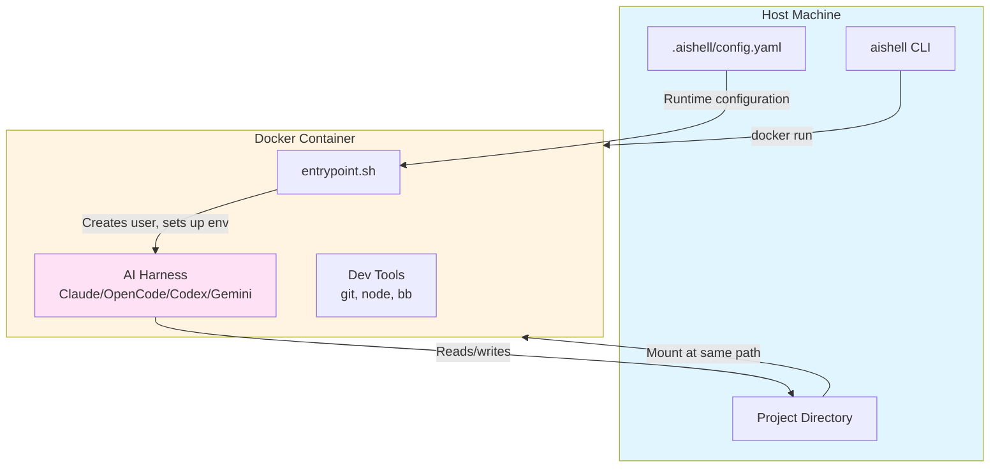

# Phase 27: Comprehensive Documentation - Research

**Researched:** 2026-01-25
**Domain:** Technical documentation for CLI tools
**Confidence:** HIGH

## Summary

This phase creates production-ready documentation for aishell, a Docker-based sandbox for AI harnesses. The goal is to transition from the existing README.md (which serves as quick-start documentation) to a comprehensive documentation suite in `/docs/` that covers architecture, configuration, harness-specific guides, troubleshooting, and development.

Research focused on documentation best practices for CLI tools in 2026, visualization strategies for architecture documentation, and common pitfalls to avoid when creating technical documentation.

**Primary recommendation:** Use a modular documentation structure with dedicated files for each major topic (Architecture, Configuration, Harnesses, Troubleshooting, Development). Leverage Mermaid.js for architecture diagrams. Focus on opinionated guidance (best-practice paths) while maintaining comprehensive reference coverage.

## Standard Stack

### Core Documentation Tools

| Tool | Version | Purpose | Why Standard |
|------|---------|---------|--------------|
| Markdown | GitHub-flavored | All documentation files | Universal support in GitHub, version control friendly, readable as plain text |
| Mermaid.js | Latest | Architecture diagrams | Native GitHub rendering, diagrams-as-code, no external image files needed |

### Supporting

| Tool | Version | Purpose | When to Use |
|------|---------|---------|------------|
| C4 Model | Concept | Architecture visualization framework | Organizing architecture diagrams into Context, Container, Component levels |

### Alternatives Considered

None - Markdown + Mermaid.js is the standard for modern developer documentation hosted on GitHub. No viable alternatives for this use case.

**Installation:**
No installation needed - Markdown and Mermaid.js render natively in GitHub.

## Architecture Patterns

### Recommended Documentation Structure

Based on the Diátaxis framework (tutorials, how-to guides, reference, explanations) and 2026 best practices:

```
docs/
├── ARCHITECTURE.md      # Explanatory - system design, data flow
├── CONFIGURATION.md     # Reference - all config options with examples
├── HARNESSES.md         # How-to - per-harness setup and usage
├── TROUBLESHOOTING.md   # How-to - common issues and solutions
└── DEVELOPMENT.md       # How-to - extending aishell
```

### Pattern 1: Diagrams-as-Code with Mermaid.js

**What:** Embed diagrams directly in Markdown using Mermaid.js code blocks that GitHub renders automatically.

**When to use:** For architecture diagrams, data flow visualizations, state machines, and sequence diagrams.

**Example:**
```markdown
## Data Flow Architecture


```

**Benefits:**
- Version controlled (text, not binary)
- Easy to update (no external tools needed)
- Renders natively in GitHub
- Accessible to screen readers

### Pattern 2: Audience-First Organization

**What:** Structure documentation based on user needs and tasks, not system internals.

**When to use:** Always - organize content by what users need to accomplish, not by how the code is organized.

**Example:**
```markdown
# CONFIGURATION.md

## Quick Start: Common Patterns
[Most-used configurations first]

## Reference: All Options
[Complete reference alphabetically]

## Advanced: Custom Scenarios
[Complex configurations last]
```

**Benefits:**
- Users find answers faster
- Progressive disclosure (simple first, complex later)
- Reduces cognitive load

### Pattern 3: Annotated Configuration Examples

**What:** Provide a single, complete configuration file example with inline comments explaining every option.

**When to use:** For configuration documentation where users need to understand all available options in context.

**Example:**
```yaml
# Full .aishell/config.yaml example with all options

# Inherit from global config (default: "global", or "none" to disable)
extends: global

# Additional directories to mount into container
mounts:
  - ~/.gitconfig                      # Git config (same path)
  - /host/path:/container/path        # Custom mapping
```

**Benefits:**
- Users can copy-paste and modify
- Shows realistic usage
- Explains merge behavior in context

### Anti-Patterns to Avoid

- **Circular References:** Documentation that references another section, which references back to the first section. Solution: Use forward references only, or consolidate related information.

- **Assuming Knowledge Level:** Writing too advanced for beginners or too simple for experienced users. Solution: Identify primary audience (aishell = intermediate CLI users) and write for them consistently.

- **Outdated Examples:** Code examples that don't match current version. Solution: Reference actual code files when possible, test examples during documentation updates.

- **Missing Context:** Providing configuration options without explaining when/why to use them. Solution: Always include "When to use" or "Use case" guidance.

## Don't Hand-Roll

Problems that look simple but have existing solutions:

| Problem | Don't Build | Use Instead | Why |
|---------|-------------|-------------|-----|
| Architecture diagrams | Draw.io files, PNG images | Mermaid.js code blocks | Version controlled, no external tools, GitHub renders natively |
| Documentation site | Custom static site generator | GitHub Pages with Markdown | Zero config, native support, familiar workflow |
| Code examples | Manually written examples | Extract from actual code | Guaranteed to be current and working |
| Navigation/TOC | Hand-written links | Markdown headers + GitHub auto-TOC | Auto-generated, always in sync |

**Key insight:** For a CLI tool hosted on GitHub, Markdown + Mermaid.js provides everything needed without external dependencies or build steps.

## Common Pitfalls

### Pitfall 1: Lack of Planning and Structure

**What goes wrong:** Documentation grows organically without a clear structure, resulting in information that's hard to find, duplicate content, and inconsistent depth across topics.

**Why it happens:** Starting to write before defining the information architecture and user journeys.

**How to avoid:**
1. Define the documentation structure upfront (5 files: Architecture, Configuration, Harnesses, Troubleshooting, Development)
2. Create templates for each file type
3. Identify what information goes where before writing

**Warning signs:**
- Can't decide which file new content belongs in
- Duplicate information across multiple files
- Users asking "where do I find X?"

### Pitfall 2: Vague and Abstract Writing

**What goes wrong:** Documentation uses abstract language without concrete examples. Users understand concepts but can't apply them.

**Why it happens:** Writers focus on what the system does instead of how users accomplish tasks.

**How to avoid:**
1. Every configuration option needs an example
2. Use "how to" framing for task-oriented content
3. Include actual command output, not just commands

**Warning signs:**
- Lots of "you can" statements without showing how
- Configuration options listed without examples
- Troubleshooting without actual error messages

### Pitfall 3: Inconsistency

**What goes wrong:** Different sections use different terminology, formatting, or depth of coverage. Destroys user confidence.

**Why it happens:** Multiple authors, incremental writing over time, or no style guide.

**How to avoid:**
1. Use consistent terminology (e.g., "harness" not "AI tool" or "agent")
2. Maintain consistent heading hierarchy
3. Use templates to ensure consistent structure

**Warning signs:**
- Same concept called by different names
- Some harnesses documented in detail, others superficially
- Heading levels jump from H2 to H4

### Pitfall 4: Ignoring Real Codebase Structure

**What goes wrong:** Documentation describes how the system "should" work instead of how it actually works. Creates confusion when behavior doesn't match docs.

**Why it happens:** Documentation written before implementation or not updated after code changes.

**How to avoid:**
1. Reference actual source files (e.g., "See src/aishell/config.clj for merge logic")
2. Extract examples from working code
3. Verify documentation against codebase during review

**Warning signs:**
- Code comments contradict documentation
- Configuration examples that don't work
- Namespace responsibilities unclear

### Pitfall 5: Missing Troubleshooting Context

**What goes wrong:** Troubleshooting guides list errors without context about when/why they occur. Users can't diagnose their own issues.

**Why it happens:** Treating troubleshooting as "error catalog" instead of diagnostic guide.

**How to avoid:**
1. Organize troubleshooting by symptom, not error message
2. Explain root causes, not just solutions
3. Include "how to diagnose" guidance

**Warning signs:**
- Solutions without explanation of why they work
- No guidance on when to use which solution
- Missing common issues users actually encounter

## Code Examples

Verified patterns from research and codebase analysis:

### Mermaid.js Architecture Diagram

Source: Mermaid.js official documentation + C4 Model pattern

```markdown
## System Architecture


```

### Configuration Documentation Structure

Source: Docker documentation pattern + aishell codebase

```markdown
## Mounts Configuration

**Purpose:** Mount additional directories into the container

**Syntax:**
```yaml
mounts:
  - /simple/path                    # Mounted at same path
  - /source:/target                 # Custom target path
  - $HOME/.config:/home/dev/.config # Environment variable expansion
```

**Use Cases:**
- **Database clients:** Mount credentials from host
- **Shared data:** Access datasets without copying into project
- **Tool configs:** Share tool configurations across projects

**Important:** Mounts happen at container start. Changes to host mounts don't require rebuild.

**Example:**
```yaml
# Mount PostgreSQL client credentials
mounts:
  - ~/.pgpass:/home/developer/.pgpass
```
```

### Harness Comparison Table

Source: CLI documentation best practices

```markdown
## Choosing a Harness

| Feature | Claude Code | OpenCode | Codex CLI | Gemini CLI |
|---------|-------------|----------|-----------|------------|
| **Provider** | Anthropic | Multiple | OpenAI | Google |
| **Auth Methods** | OAuth, API Key | Per-provider | OAuth, API Key | OAuth, API Key |
| **Container Auth** | ✅ Copy-paste URL | ✅ Standard | ⚠️ Device code needed | ⚠️ Auth on host first |
| **Vertex AI Support** | ❌ | ✅ | ❌ | ✅ |
| **Best For** | Autonomous coding | Multi-model flexibility | ChatGPT integration | Gemini models |
```

## State of the Art

| Old Approach | Current Approach | When Changed | Impact |
|--------------|------------------|--------------|--------|
| README.md everything | Modular /docs structure | 2024-2026 | Easier to maintain, better navigation |
| Binary diagram images | Mermaid.js diagrams-as-code | 2022-2025 | Version controlled, no external tools |
| Alphabetical config reference | Use-case organized with examples | 2025-2026 | Faster to find relevant options |
| Single authentication method | Present all options equally | 2026 | Users choose based on their constraints |

**Deprecated/outdated:**
- **Static site generators for simple docs:** Markdown on GitHub is sufficient for CLI tool documentation
- **Separate example repository:** Examples should be inline in documentation
- **Wiki-style documentation:** Linear, structured documentation is easier to navigate

## Open Questions

Things that couldn't be fully resolved:

1. **How deep should ARCHITECTURE.md go into Clojure namespace details?**
   - What we know: Codebase has clear namespace structure (aishell.core, aishell.cli, aishell.config, etc.)
   - What's unclear: Target audience is end-users (not contributors), so deep code internals may not be needed
   - Recommendation: Focus on high-level architecture (Host → Container → Harness flow) and only mention key namespaces when explaining data flow. Leave detailed namespace documentation for DEVELOPMENT.md.

2. **Should HARNESSES.md include model-specific guidance?**
   - What we know: Different harnesses support different models (Claude Sonnet, GPT-4, Gemini Pro, etc.)
   - What's unclear: Whether to document model selection patterns or leave to harness-specific docs
   - Recommendation: Document how to pass model selection flags to each harness, but link to official harness docs for model capabilities/pricing.

3. **How to handle documentation versioning?**
   - What we know: aishell has version 2.3.0, will evolve
   - What's unclear: Whether to version documentation or always document latest
   - Recommendation: Document current version (2.4.0) and rely on git history for older versions. Add "Last updated: vX.Y.Z" to each doc file.

## Sources

### Primary (HIGH confidence)

- **Codebase analysis:**
  - `/home/jonasrodrigues/projects/harness/src/aishell/` - Analyzed namespace structure and responsibilities
  - `/home/jonasrodrigues/projects/harness/src/aishell/config.clj` - Configuration merge strategy and validation
  - `/home/jonasrodrigues/projects/harness/src/aishell/docker/templates.clj` - Dockerfile, entrypoint, bashrc contents
  - `/home/jonasrodrigues/projects/harness/README.md` - Existing documentation foundation from phase 26
  - `/home/jonasrodrigues/projects/harness/.aishell/config.yaml` - Full annotated configuration example

- **Phase 27 Context:**
  - `.planning/phases/27-comprehensive-documentation/27-CONTEXT.md` - User decisions about structure, audience, and style
  - `.planning/phases/26-documentation/26-01-SUMMARY.md` - Foundation work completed in phase 26

### Secondary (MEDIUM confidence)

- [Command Line Interface Guidelines](https://clig.dev/) - CLI documentation best practices (verified via multiple sources)
- [Docker CLI Documentation](https://docs.docker.com/reference/cli/docker/) - Reference example for CLI tool documentation structure
- [Mermaid.js Official Documentation](https://mermaid.js.org/intro/syntax-reference.html) - Diagram syntax and best practices
- [GitHub: Documentation done right: A developer's guide](https://github.blog/developer-skills/documentation-done-right-a-developers-guide/) - 2026 documentation practices
- [Write the Docs: Software documentation guide](https://www.writethedocs.org/guide/index.html) - Documentation structure patterns

### Secondary (documentation best practices verified across multiple sources)

- [The Ultimate Guide To Software Architecture Documentation](https://www.workingsoftware.dev/software-architecture-documentation-the-ultimate-guide/) - C4 Model and architecture visualization
- [Mastering Mermaid.js: The Complete Guide](https://antoinegriffard.com/posts/mermaid-js-comprehensive-guide/) - Mermaid diagram best practices
- [10 Common Developer Documentation Mistakes to Avoid](https://document360.com/blog/developer-documentation-mistakes/) - Common pitfalls catalog
- [6 Common Mistakes in Writing Technical Documentation](https://www.archbee.com/blog/technical-writing-mistakes/) - Pitfalls and prevention strategies

## Metadata

**Confidence breakdown:**
- Standard stack: HIGH - Markdown + Mermaid.js is universally accepted for GitHub-hosted CLI documentation
- Architecture patterns: HIGH - Patterns verified through codebase analysis and multiple authoritative sources
- Pitfalls: HIGH - Common mistakes documented consistently across 5+ sources and verified against phase 26 work

**Research date:** 2026-01-25
**Valid until:** 90 days (documentation best practices are stable, Mermaid.js syntax is stable)
