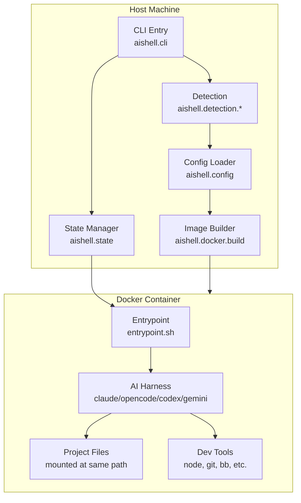

# aishell Architecture

This document describes the internal architecture of aishell, including the data flow from host machine through container execution, and the responsibilities of each code namespace.

**Last updated:** v2.4.0

---

## Table of Contents

- [System Overview](#system-overview)
- [Data Flow](#data-flow)
- [Namespace Responsibilities](#namespace-responsibilities)
- [Key Files](#key-files)
- [Extension System](#extension-system)

---

## System Overview

aishell orchestrates ephemeral Docker containers for AI harnesses. The system is split across two environments:

- **Host Machine:** CLI, configuration loading, Docker API interaction
- **Container:** Harness tools, project files, isolated execution environment



**Key architectural principles:**

1. **Immutable Base Image:** Built once with selected harnesses, reused for all projects
2. **Project Extension:** Optional per-project Dockerfile extends base image
3. **Configuration Merge:** Global and project configs combine with defined semantics
4. **Stateless Containers:** No data persists in container; all work is in mounted project dir
5. **Security Layers:** Detection (filename patterns) + Gitleaks (content scanning) before launch

---

## Data Flow

### Build Phase

The build phase creates the base Docker image with optional harness tools.

```
┌──────────────────┐
│ aishell build    │
│ --with-claude    │
└────────┬─────────┘
         │
         ▼
┌──────────────────────────────────────────┐
│ aishell.docker.build/build-base-image    │
│ - Check cache (Dockerfile hash)          │
│ - Check version changes                  │
│ - Write templates to temp dir            │
│ - Construct docker build command         │
└────────┬─────────────────────────────────┘
         │
         ▼
┌──────────────────────────────────────────┐
│ Docker Build                             │
│ - FROM debian:bookworm-slim              │
│ - Install system packages                │
│ - Install Node.js, Babashka, Gosu        │
│ - Install harnesses (if WITH_X=true)     │
│ - Tag: aishell:base                      │
└────────┬─────────────────────────────────┘
         │
         ▼
┌──────────────────────────────────────────┐
│ aishell.state/write-state                │
│ - Store build flags                      │
│ - Store harness versions                 │
│ - Store Dockerfile hash                  │
│ - Location: ~/.aishell/state.edn         │
└──────────────────────────────────────────┘
```

**Build artifacts:**

- Docker image: `aishell:base` (tagged locally)
- State file: `~/.aishell/state.edn` (EDN format)
- Build labels: Metadata embedded in image

### Run Phase

The run phase executes a harness (or shell) in a container with project files mounted.

```
┌──────────────────┐
│ aishell claude   │
│ --model sonnet   │
└────────┬─────────┘
         │
         ▼
┌──────────────────────────────────────────┐
│ aishell.run/run-container                │
│ 1. Check Docker available               │
│ 2. Read state (verify harness built)    │
│ 3. Resolve image (base or extended)     │
│ 4. Load config (merge global+project)   │
│ 5. Run detection checks (unless --unsafe)│
│ 6. Build docker run command             │
└────────┬─────────────────────────────────┘
         │
         ▼
┌──────────────────────────────────────────┐
│ Security Checks                          │
│ - aishell.detection.core (filename scan) │
│ - aishell.gitleaks.warnings (freshness)  │
│ - aishell.validation (dangerous args)    │
└────────┬─────────────────────────────────┘
         │
         ▼
┌──────────────────────────────────────────┐
│ Docker Run                               │
│ docker run --rm -it \                    │
│   -v /path/to/project:/path/to/project \ │
│   -v ~/.ssh:/home/user/.ssh:ro \         │
│   -e GIT_AUTHOR_NAME=... \               │
│   aishell:base \                         │
│   claude --model sonnet                  │
└────────┬─────────────────────────────────┘
         │
         ▼
┌──────────────────────────────────────────┐
│ Container Execution                      │
│ entrypoint.sh:                           │
│ 1. Create user matching host UID/GID    │
│ 2. Setup home directory                 │
│ 3. Run pre_start command (if configured)│
│ 4. Switch to user (via gosu)            │
│ 5. Execute harness command              │
└──────────────────────────────────────────┘
```

**Data mounts:**

- Project directory → Mounted at same path as host (read-write)
- `~/.ssh` → SSH keys (read-only)
- `~/.gitconfig` → Git config (optional, read-only)
- Additional mounts from `config.yaml`

### Config Merge Strategy

Configuration files are merged with defined semantics based on the `extends` key.

```
┌─────────────────────────────┐
│ ~/.aishell/config.yaml      │
│ (global defaults)           │
└──────────┬──────────────────┘
           │
           │ extends: global (default)
           │
           ▼
┌─────────────────────────────┐     ┌──────────────────────────┐
│ .aishell/config.yaml        │────▶│ Merged Config            │
│ (project overrides)         │     │ - Lists: concatenate     │
└─────────────────────────────┘     │ - Maps: shallow merge    │
                                    │ - Scalars: project wins  │
                                    └──────────────────────────┘

           extends: none
           │
           ▼
┌─────────────────────────────┐
│ .aishell/config.yaml        │
│ (fully replaces global)     │
└─────────────────────────────┘
```

For detailed merge behavior, see [Configuration Reference](./CONFIGURATION.md).

---

## Namespace Responsibilities

aishell is organized into focused namespaces, each handling a specific concern.

### Core Namespaces

| Namespace | Responsibility | Key Functions |
|-----------|----------------|---------------|
| `aishell.cli` | Command-line interface | Argument parsing, command dispatch, help text |
| `aishell.config` | Configuration loading | YAML parsing, global+project merge, validation |
| `aishell.run` | Container orchestration | Harness routing, security checks, `docker run` exec |
| `aishell.state` | Build state persistence | Read/write `~/.aishell/state.edn` |
| `aishell.output` | Terminal formatting | Colored output, error handling |
| `aishell.util` | Shared utilities | Path helpers, home directory resolution |
| `aishell.validation` | Config validation | Warn about dangerous docker_args/mounts |

### Docker Namespaces

| Namespace | Responsibility | Key Functions |
|-----------|----------------|---------------|
| `aishell.docker` | Docker API wrapper | Image existence checks, label reading |
| `aishell.docker.build` | Image building | Cache validation, build execution, progress display |
| `aishell.docker.templates` | Embedded build files | Dockerfile, entrypoint.sh, bashrc content |
| `aishell.docker.run` | Container execution | Construct `docker run` arguments |
| `aishell.docker.hash` | Cache invalidation | Compute Dockerfile content hash |
| `aishell.docker.spinner` | Build UI | Animated spinner during quiet builds |
| `aishell.docker.extension` | Project extensions | Build per-project extended images |

### Security Namespaces

| Namespace | Responsibility | Key Functions |
|-----------|----------------|---------------|
| `aishell.detection.core` | Sensitive file detection | Scan project dir for .env, keys, credentials |
| `aishell.detection.patterns` | Detection rules | Default patterns for sensitive files |
| `aishell.detection.formatters` | Detection output | Format findings for user display |
| `aishell.detection.gitignore` | Gitignore integration | Skip gitignored files during scan |
| `aishell.gitleaks.scan_state` | Gitleaks state tracking | Timestamp management for scan freshness |
| `aishell.gitleaks.warnings` | Gitleaks freshness warnings | Advisory warnings when scans are stale |

**Security architecture:**

1. **Detection layer (aishell.detection.*):** Filename-based pattern matching
   - Fast, runs every time unless `--unsafe`
   - Configurable via `detection:` in config.yaml
   - Supports custom patterns and allowlists

2. **Gitleaks layer (aishell.gitleaks.*):** Content-based secret scanning
   - Slow, runs on-demand via `aishell gitleaks dir .`
   - Advisory freshness warnings (>7 days stale)
   - Never blocks execution (advisory only)

3. **Validation layer (aishell.validation):** Config safety checks
   - Warns about dangerous `docker_args` (--privileged, --network=host)
   - Warns about dangerous mounts (/etc, /var/run/docker.sock)

---

## Key Files

### Host Files

| Path | Purpose | Format | Persistence |
|------|---------|--------|-------------|
| `~/.aishell/state.edn` | Build state (harnesses, versions, hash) | EDN | Persistent |
| `~/.aishell/config.yaml` | Global config defaults | YAML | Persistent |
| `~/.aishell/gitleaks-scan.edn` | Per-project Gitleaks scan timestamps | EDN | Persistent |
| `.aishell/config.yaml` | Project-specific config | YAML | Persistent (in project) |
| `.aishell/Dockerfile` | Optional project extension | Dockerfile | Persistent (in project) |

### Container Files

| Path | Purpose | Generated From |
|------|---------|----------------|
| `/entrypoint.sh` | Container initialization script | `aishell.docker.templates/entrypoint-script` |
| `/etc/skel/.bashrc.aishell` | Shell customizations | `aishell.docker.templates/bashrc-content` |
| `$PWD` | Project directory (mounted at same path as host) | Host CWD |
| `/home/user` | Dynamic user home | Created by entrypoint.sh |

**State file schema (`~/.aishell/state.edn`):**

```clojure
{:with-claude true             ; boolean: Claude Code installed?
 :with-opencode false          ; boolean: OpenCode installed?
 :with-codex false             ; boolean: Codex CLI installed?
 :with-gemini false            ; boolean: Gemini CLI installed?
 :claude-version "2.0.22"      ; string or nil: pinned version
 :opencode-version nil         ; string or nil: pinned version
 :codex-version "0.89.0"       ; string or nil: pinned version
 :gemini-version nil           ; string or nil: pinned version
 :image-tag "aishell:base"     ; string: Docker image tag
 :build-time "2026-01-25..."   ; ISO-8601 timestamp
 :dockerfile-hash "abc123def"}  ; 12-char SHA-256 hash
```

---

## Extension System

Projects can extend the base image with custom Dockerfile layers.

**Extension flow:**

```
Base Image                Project Extension           Extended Image
(aishell:base)            (.aishell/Dockerfile)       (aishell:ext-abc123)
     │                           │                           │
     │                           │                           │
     ▼                           ▼                           ▼
┌─────────┐               ┌─────────────┐            ┌──────────────┐
│ Debian  │               │ FROM         │            │ aishell:base │
│ Node.js │               │ aishell:base │            │ +            │
│ Harness │    +          │              │    →       │ Custom Layers│
│ Gosu    │               │ RUN ...      │            │ (postgres,   │
│ Tools   │               │ COPY ...     │            │  python,     │
└─────────┘               └─────────────┘            │  etc.)       │
                                                      └──────────────┘
```

**Extension behavior:**

1. **Auto-build:** If `.aishell/Dockerfile` exists, extension builds automatically before run
2. **Cache:** Extended image tagged with hash (content-based), rebuilt only on Dockerfile changes
3. **Base dependency:** Extension requires base image to exist (`aishell build` must run first)
4. **Persistence:** Extended images persist locally, shared across runs

**Example project extension:**

```dockerfile
# .aishell/Dockerfile
FROM aishell:base

# Install PostgreSQL client
RUN apt-get update && apt-get install -y postgresql-client && rm -rf /var/lib/apt/lists/*

# Install Python tools
RUN apt-get update && apt-get install -y python3-pip && rm -rf /var/lib/apt/lists/*
```

For more details, see the Dockerfile extension section in the Configuration Reference.

---

## Architecture Decisions

**Why Babashka?**

- **Fast startup:** JVM-free Clojure interpreter (sub-10ms startup vs ~1s for JVM)
- **Single binary:** No dependency management, works in containers
- **Shell interop:** First-class support for calling Docker CLI

**Why gosu for user switching?**

- **Clean process tree:** Exec's the target command (no wrapper process)
- **No sudo overhead:** Designed for containers, lighter than sudo
- **UID/GID matching:** Ensures created files have correct ownership on host

**Why immutable base + extensions?**

- **Fast iteration:** Base image builds once, projects build extensions in seconds
- **Reproducibility:** Same base shared across all projects
- **Flexibility:** Projects can add languages, databases, or tools without rebuilding base

**Why two-layer security (detection + gitleaks)?**

- **Speed vs thoroughness:** Detection is instant, Gitleaks is comprehensive
- **Fail-fast:** Catch obvious mistakes before expensive builds
- **Non-blocking:** Advisory warnings never block power users
