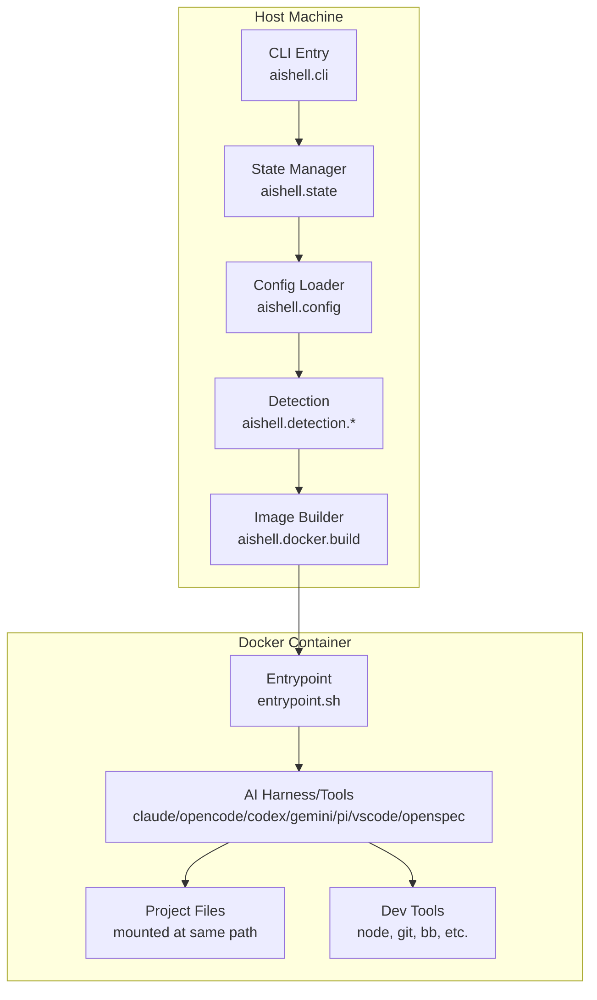

# aishell Architecture

This document covers aishell's internal architecture: data flow from host through container, and each namespace's responsibilities.

**Last updated:** v3.8.0

---

## Table of Contents

- [System Overview](#system-overview)
- [Data Flow](#data-flow)
- [Namespace Responsibilities](#namespace-responsibilities)
- [Key Files](#key-files)
- [Extension System](#extension-system)
- [Cross-Platform Architecture](#cross-platform-architecture)

---

## System Overview

aishell orchestrates ephemeral Docker containers for AI harnesses, split across two environments:

- **Host Machine:** CLI, configuration loading, Docker API interaction
- **Container:** Harness tools, project files, isolated execution environment



**Architectural principles:**

1. **Three-Tier Image Chain:** Foundation image (stable system tools) -> Base image (optional global customization) -> Extension image (per-project)
2. **Volume-Based Harness Tools:** npm packages and binaries mounted read-only at `/tools`
3. **Global Base Customization:** Optional `~/.aishell/Dockerfile` customizes the base image for all projects
4. **Project Extension:** Optional per-project `.aishell/Dockerfile` extends the base image
5. **Configuration Merge:** Global and project configs combine with defined semantics
6. **Stateless Containers:** No data persists in container; all work is in mounted project dir
7. **Security Layers:** Detection (filename patterns) + Gitleaks (opt-in content scanning) before launch

---

## Three-Tier Image Chain + Harness Volume

aishell uses a three-tier image chain with a separate harness volume for tools:

```
aishell:foundation -> aishell:base -> aishell:ext-{hash}
```

- **`aishell:foundation`** -- Stable system dependencies (Debian, Node.js, tools). Rebuilt rarely.
- **`aishell:base`** -- Either a tag alias for foundation (default) or a custom build from `~/.aishell/Dockerfile`. Enables global customization (extra packages, shell config, dev tools) shared across all projects.
- **`aishell:ext-{hash}`** -- Per-project extension built from `.aishell/Dockerfile`. Adds project-specific layers on top of `aishell:base`.

Base image changes cascade automatically: when `aishell:base` is rebuilt, all project extension images rebuild on their next run.

### Foundation Image (`aishell:foundation`)

The foundation image contains stable system components that change rarely:

**Contents:**
- Debian bookworm-slim base
- Node.js 24 runtime
- Babashka CLI runtime
- System tools (git, curl, jq, ripgrep, vim, etc.)
- fd (fd-find with symlink for pi file discovery)
- Gitleaks binary (opt-in, via `--with-gitleaks`)
- Gosu for user switching
- Entrypoint script and profile configuration

**Rebuild triggers:**
- Dockerfile template changes (detected via content hash)
- Explicit `aishell update --force`

**Why separate:** These components stay stable across harness version updates.

### Base Image (`aishell:base`)

The base image is the intermediate layer between foundation and project extensions. It always exists as a valid Docker tag.

**Default behavior (no `~/.aishell/Dockerfile`):**
- `aishell:base` is a tag alias for `aishell:foundation` (via `docker tag`)
- Zero overhead -- no extra image built

**Custom behavior (with `~/.aishell/Dockerfile`):**
- Built from `~/.aishell/Dockerfile` (recommended: `FROM aishell:foundation`)
- Applies global customizations shared by all projects
- Built lazily on first container run, not during `aishell setup`

**Cache tracking via Docker labels:**
- `aishell.base.dockerfile.hash` -- 12-char SHA-256 of `~/.aishell/Dockerfile` content
- `aishell.base.foundation.id` -- Foundation image ID at base build time

**Rebuild triggers:**
- `~/.aishell/Dockerfile` content changes (hash mismatch)
- Foundation image updated (image ID mismatch)
- `aishell:base` image missing
- Explicit `aishell setup --force` or `aishell update --force`

**Cascade effect:** When `aishell:base` is rebuilt, all project extension images (`aishell:ext-{hash}`) auto-rebuild on their next run. Extensions track the base image ID via labels, so a new base image invalidates their cache.

**Reset procedure:**
1. Delete `~/.aishell/Dockerfile`
2. On next run, `aishell:base` reverts to a foundation alias
3. Run `aishell volumes prune` to clean up the orphaned custom base image

### Harness Volume (`aishell-harness-{hash}`)

Docker volumes store harness tools and mount them into containers:

**Contents:**
- `/tools/npm` - npm global packages (@anthropic-ai/claude-code, @openai/codex, @google/gemini-cli, @mariozechner/pi-coding-agent, @fission-ai/openspec)
- `/tools/bin` - Go binaries (opencode)

**Volume naming:** `aishell-harness-{12-char-hash}` where hash is computed from:
- Enabled harnesses (which flags passed to build)
- Enabled tools (e.g., OpenSpec)
- Harness versions (pinned or 'latest')
- Alphabetically sorted for order-independence

**Volume sharing:** Projects with identical harness configurations share a volume.

**Rebuild triggers:**
- `aishell update` (unconditional delete + recreate)
- Missing volume
- Hash mismatch (different harness config)

**Why separate:** Harness updates skip multi-gigabyte foundation image rebuilds and Docker extension cache invalidation.

### Runtime Wiring

**Volume mount:**
```bash
-v aishell-harness-abc123:/tools:ro
```

Mounted read-only for toolchain integrity.

**PATH setup:**
1. Entrypoint sets `HARNESS_VOLUME` env var as a signal
2. Checks directory existence: `if [ -d /tools/npm/bin ]`
3. Prepends to PATH: `/tools/npm/bin:/tools/bin:$PATH`
4. Sets NODE_PATH: `/tools/npm/lib/node_modules`

**Profile.d integration:**
`/etc/profile.d/aishell.sh` ensures login shells inherit PATH configuration.

### Migration

**From v2.7.0 to v2.8.0:**

**Image tag change:**
- Old: `aishell:base` (was the only image)
- New: `aishell:foundation` (stable system image)
- `aishell:base` is now the intermediate layer (always exists as alias or custom build)

**Project `.aishell/Dockerfile` FROM line:**
Both `FROM aishell:base` (recommended) and `FROM aishell:foundation` are accepted. Using `FROM aishell:base` inherits any global customizations from `~/.aishell/Dockerfile`.

**State schema evolution:**
- New fields: `foundation-hash`, `harness-volume-hash`, `harness-volume-name`
- Deprecated (but still written): `dockerfile-hash` → `foundation-hash`
- Additive migration: nil values for missing fields, no migration code needed

---

## Data Flow

### Build Phase

The build phase creates the foundation Docker image and populates the harness volume:

```
┌──────────────────┐
│ aishell setup    │
│ --with-claude    │
└────────┬─────────┘
         │
         ▼
┌──────────────────────────────────────────────┐
│ aishell.docker.build/build-foundation-image  │
│ - Check cache (Dockerfile template hash)     │
│ - Write templates to temp dir                │
│ - Construct docker build command             │
└────────┬─────────────────────────────────────┘
         │
         ▼
┌──────────────────────────────────────────────┐
│ Docker Build (Foundation)                    │
│ - FROM debian:bookworm-slim                  │
│ - Install system packages                    │
│ - Install Node.js, Babashka, Gosu             │
│ - Install Gitleaks (if --with-gitleaks)        │
│ - Tag: aishell:foundation                    │
└────────┬─────────────────────────────────────┘
         │
         ▼
┌──────────────────────────────────────────────┐
│ aishell.docker.volume/compute-harness-hash   │
│ - Hash enabled harnesses + versions          │
│ - Generate volume name: aishell-harness-{hash}│
└────────┬─────────────────────────────────────┘
         │
         ▼
┌──────────────────────────────────────────────┐
│ aishell.docker.volume/populate-volume        │
│ - Create volume if missing                   │
│ - Run temporary container with --rm          │
│ - npm install to /tools/npm                  │
│ - Download binaries to /tools/bin            │
│ - Set world-readable permissions             │
└────────┬─────────────────────────────────────┘
         │
         ▼
┌──────────────────────────────────────────────┐
│ aishell.state/write-state                    │
│ - Store build flags                          │
│ - Store harness versions                     │
│ - Store foundation-hash                      │
│ - Store harness-volume-name                  │
│ - Location: ~/.aishell/state.edn             │
└──────────────────────────────────────────────┘
```

**Build artifacts:**

- Docker image: `aishell:foundation` (tagged locally)
- Docker volume: `aishell-harness-{hash}` (contains harness tools)
- State file: `~/.aishell/state.edn` (EDN format)
- Build labels: Metadata embedded in image and volume

### Run Phase

The run phase executes a harness (or shell) in a container with project files mounted:

```
┌──────────────────┐
│ aishell claude   │
│ --model sonnet   │
└────────┬─────────┘
         │
         ▼
┌──────────────────────────────────────────┐
│ aishell.run/run-container                │
│ 1. Check Docker available               │
│ 2. Read state (verify harness built)    │
│ 3. Resolve image (base or extended)     │
│ 4. Load config (merge global+project)   │
│ 5. Run detection checks (unless --unsafe)│
│ 6. Build docker run command             │
└────────┬─────────────────────────────────┘
         │
         ▼
┌──────────────────────────────────────────┐
│ Security Checks                          │
│ - aishell.detection.core (filename scan) │
│ - aishell.gitleaks.warnings (freshness)  │
│ - aishell.validation (dangerous args)    │
└────────┬─────────────────────────────────┘
         │
         ▼
┌──────────────────────────────────────────┐
│ Docker Run                               │
│ docker run --rm -it \                    │
│   -v /path/to/project:/path/to/project \ │
│   -v ~/.claude:/home/user/.claude \      │
│   -e GIT_AUTHOR_NAME=... \               │
│   aishell:foundation \                   │
│   claude --model sonnet                  │
└────────┬─────────────────────────────────┘
         │
         ▼
┌──────────────────────────────────────────┐
│ Container Execution                      │
│ entrypoint.sh:                           │
│ 1. Create user matching host UID/GID    │
│ 2. Setup home directory                 │
│ 3. Run pre_start command (if configured)│
│ 4. Validate TERM (fallback xterm-256color)│
│ 5. Execute command via gosu             │
└──────────────────────────────────────────┘
```

**Data mounts:**

- Project directory → Mounted at same path as host (read-write)
- Harness config directories -> Per-harness (e.g., `~/.claude`, `~/.codex`, `~/.pi`)
- Additional mounts from `config.yaml` (e.g., `~/.ssh`, `~/.gitconfig`)

### Config Merge Strategy

The `extends` key controls how configuration files merge:

```
┌─────────────────────────────┐
│ ~/.aishell/config.yaml      │
│ (global defaults)           │
└──────────┬──────────────────┘
           │
           │ extends: global (default)
           │
           ▼
┌─────────────────────────────┐     ┌──────────────────────────┐
│ .aishell/config.yaml        │────▶│ Merged Config            │
│ (project overrides)         │     │ - Lists: concatenate     │
└─────────────────────────────┘     │ - Maps: shallow merge    │
                                    │ - Scalars: project wins  │
                                    └──────────────────────────┘

           extends: none
           │
           ▼
┌─────────────────────────────┐
│ .aishell/config.yaml        │
│ (fully replaces global)     │
└─────────────────────────────┘
```

For detailed merge behavior, see [Configuration Reference](./CONFIGURATION.md).

---

## Namespace Responsibilities

Each namespace handles one concern:

### Core Namespaces

| Namespace | Responsibility | Key Functions |
|-----------|----------------|---------------|
| `aishell.cli` | Command-line interface | Argument parsing, command dispatch, help text |
| `aishell.config` | Configuration loading | YAML parsing, global+project merge, validation |
| `aishell.run` | Container orchestration | Harness routing, security checks, `docker run` exec |
| `aishell.state` | Build state persistence | Read/write `~/.aishell/state.edn` |
| `aishell.output` | Terminal formatting | Colored output, error handling |
| `aishell.util` | Shared utilities | Path helpers, home directory resolution |
| `aishell.attach` | Attach command | Open shell in running containers via docker exec |
| `aishell.vscode` | VSCode integration | Open VSCode attached to container as developer user |
| `aishell.info` | Image stack info | Display foundation contents, base/extension status, harnesses |
| `aishell.check` | Pre-flight checks | Validate Docker, config, image state, tool availability |
| `aishell.validation` | Config validation | Warn about dangerous docker_args/mounts |

### Docker Namespaces

| Namespace | Responsibility | Key Functions |
|-----------|----------------|---------------|
| `aishell.docker` | Docker API wrapper | Image existence checks, label reading |
| `aishell.docker.build` | Image building | Cache validation, build execution, progress display |
| `aishell.docker.templates` | Embedded build files | Dockerfile, entrypoint.sh, bashrc content |
| `aishell.docker.run` | Container execution | Construct `docker run` arguments |
| `aishell.docker.hash` | Cache invalidation | Compute Dockerfile content hash |
| `aishell.docker.spinner` | Build UI | Animated spinner during quiet builds |
| `aishell.docker.naming` | Container naming | Deterministic naming, Docker state queries, conflict detection |
| `aishell.docker.extension` | Project extensions | Build per-project extended images |
| `aishell.docker.volume` | Volume management | Harness volume creation, population, hash computation, listing, pruning |

### Security Namespaces

| Namespace | Responsibility | Key Functions |
|-----------|----------------|---------------|
| `aishell.detection.core` | Sensitive file detection | Scan project dir for .env, keys, credentials |
| `aishell.detection.patterns` | Detection rules | Default patterns for sensitive files |
| `aishell.detection.formatters` | Detection output | Format findings for user display |
| `aishell.detection.gitignore` | Gitignore integration | Skip gitignored files during scan |
| `aishell.gitleaks.scan_state` | Gitleaks state tracking | Timestamp management for scan freshness |
| `aishell.gitleaks.warnings` | Gitleaks freshness warnings | Advisory warnings when scans are stale |

**Security architecture:**

1. **Detection layer (aishell.detection.*):** Filename-based pattern matching
   - Fast, runs every time unless `--unsafe`
   - Configurable via `detection:` in config.yaml
   - Supports custom patterns and allowlists

2. **Gitleaks layer (aishell.gitleaks.*):** Content-based secret scanning (opt-in via `--with-gitleaks`)
   - Requires `--with-gitleaks` build flag; not available by default
   - Slower; runs on-demand via `aishell gitleaks dir .`
   - Warns when scans exceed 7 days old
   - Advisory only; never blocks execution

3. **Validation layer (aishell.validation):** Config safety checks
   - Warns about dangerous `docker_args` (--privileged, --network=host)
   - Warns about dangerous mounts (/etc, /var/run/docker.sock)

---

## Key Files

### Host Files

| Path | Purpose | Format | Persistence |
|------|---------|--------|-------------|
| `~/.aishell/state.edn` | Build state (harnesses, versions, hash) | EDN | Persistent |
| `~/.aishell/config.yaml` | Global config defaults | YAML | Persistent |
| `~/.aishell/Dockerfile` | Optional global base image customization | Dockerfile | Persistent |
| `~/.aishell/gitleaks-scan.edn` | Per-project Gitleaks scan timestamps | EDN | Persistent |
| `.aishell/config.yaml` | Project-specific config | YAML | Persistent (in project) |
| `.aishell/Dockerfile` | Optional project extension | Dockerfile | Persistent (in project) |

### Container Files

| Path | Purpose | Generated From |
|------|---------|----------------|
| `/entrypoint.sh` | Container initialization script | `aishell.docker.templates/entrypoint-script` |
| `/etc/skel/.bashrc.aishell` | Shell customizations | `aishell.docker.templates/bashrc-content` |
| `$PWD` | Project directory (mounted at same path as host) | Host CWD |
| `/home/user` | Dynamic user home | Created by entrypoint.sh |

**State file schema (`~/.aishell/state.edn`):**

```clojure
{:with-claude true                       ; boolean: Claude Code enabled?
 :with-opencode false                    ; boolean: OpenCode enabled?
 :with-codex false                       ; boolean: Codex CLI enabled?
 :with-gemini false                      ; boolean: Gemini CLI enabled?
 :with-pi false                         ; boolean: Pi coding agent enabled?
 :with-openspec false                   ; boolean: OpenSpec tool enabled? (opt-in, not a harness)
 :openspec-version nil                  ; string or nil: pinned version
 :with-gitleaks false                    ; boolean: Gitleaks installed? (opt-in, default false)
 :claude-version "2.0.22"                ; string or nil: pinned version
 :opencode-version nil                   ; string or nil: pinned version
 :codex-version "0.89.0"                 ; string or nil: pinned version
 :gemini-version nil                     ; string or nil: pinned version
 :pi-version nil                        ; string or nil: pinned version
 :image-tag "aishell:foundation"         ; string: Docker image tag
 :build-time "2026-02-01T12:00:00Z"      ; ISO-8601 timestamp
 :foundation-hash "abc123def"            ; 12-char SHA-256 hash (NEW in v2.8.0)
 :harness-volume-hash "def456ghi"        ; 12-char hash of harness config (NEW in v2.8.0)
 :harness-volume-name "aishell-harness-def456ghi" ; Volume name (NEW in v2.8.0)
 :dockerfile-hash "abc123def"}           ; DEPRECATED: use :foundation-hash (kept for backward compat)
```

---

## Extension System

Projects extend the base image with custom Dockerfile layers, forming the third tier of the image chain.

**Extension flow (three-tier chain):**

```
Foundation Image     Global Customization      Base Image          Project Extension      Extended Image
(aishell:foundation) (~/.aishell/Dockerfile)   (aishell:base)      (.aishell/Dockerfile)  (aishell:ext-{hash})
     │                       │                      │                      │                      │
     ▼                       ▼                      ▼                      ▼                      ▼
┌──────────┐          ┌─────────────┐         ┌──────────┐         ┌─────────────┐         ┌──────────────┐
│ Debian   │          │ FROM        │         │ foundation│         │ FROM        │         │ aishell:base │
│ Node.js  │   →      │ aishell:    │   →     │ + global  │   →    │ aishell:base│   →     │ + project    │
│ Tools    │          │ foundation  │         │ packages  │         │             │         │ packages     │
│ Gosu     │          │ RUN ...     │         │ shell cfg │         │ RUN ...     │         │ (postgres,   │
│ etc.     │          │             │         │ dev tools │         │ COPY ...    │         │  python, etc)│
└──────────┘          └─────────────┘         └──────────┘         └─────────────┘         └──────────────┘
                      (optional)                                   (optional)
```

When no `~/.aishell/Dockerfile` exists, `aishell:base` is a tag alias for `aishell:foundation` (zero overhead). When no `.aishell/Dockerfile` exists, the container runs directly on `aishell:base`.

**Extension behavior:**

1. **Auto-build:** If `.aishell/Dockerfile` exists, the extension builds automatically before run
2. **Cache:** Extended image tagged by content hash; rebuilt only on Dockerfile or base image changes
3. **Base dependency:** Extension builds on `aishell:base` (which inherits any global customizations)
4. **Cascade rebuilds:** When `aishell:base` changes, extensions auto-rebuild on next run
5. **Persistence:** Extended images persist locally and are shared across runs

**Example project extension:**

```dockerfile
# .aishell/Dockerfile
FROM aishell:base

# Install PostgreSQL client
RUN apt-get update && apt-get install -y postgresql-client && rm -rf /var/lib/apt/lists/*

# Install Python tools
RUN apt-get update && apt-get install -y python3-pip && rm -rf /var/lib/apt/lists/*
```

Both `FROM aishell:base` (recommended) and `FROM aishell:foundation` are accepted. Using `FROM aishell:base` inherits any global customizations from `~/.aishell/Dockerfile`.

See the Dockerfile extension section in the Configuration Reference for details.

---

## Architecture Decisions

**Why Babashka?**

- **Fast startup:** JVM-free Clojure interpreter starts in under 10ms (vs ~1s for JVM)
- **Single binary:** No dependency management; works in containers
- **Shell interop:** First-class support for calling the Docker CLI

**Why gosu for user switching?**

- **Clean process tree:** Execs the target command directly (no wrapper process)
- **No sudo overhead:** Designed for containers; lighter than sudo
- **UID/GID matching:** Files created in the container get correct ownership on the host

**Why immutable base + extensions?**

- **Fast iteration:** Base image builds once; projects add extensions in seconds
- **Reproducibility:** All projects share the same base
- **Flexibility:** Projects add languages, databases, or tools without rebuilding the base

**Why two-layer security (detection + gitleaks)?**

- **Speed vs thoroughness:** Detection runs instantly; Gitleaks (when installed) scans comprehensively
- **Fail-fast:** Catches obvious mistakes before expensive builds
- **Non-blocking:** Advisory warnings never block power users

---

## Cross-Platform Architecture

aishell v3.1.0 adds native Windows support using host-side platform detection with Linux containers via Docker Desktop WSL2 backend.

### Design Principles

**1. Host-side platform detection, container-side Linux-only**

aishell uses `babashka.fs/windows?` for conditional logic on the host machine, but containers are always Linux (Debian bookworm-slim). Docker Desktop's WSL2 backend provides Linux containers on Windows, covering 95%+ of Windows Docker users.

**Rationale:** Native Windows containers would require separate Dockerfile and entrypoint scripts. The WSL2 approach provides broad Windows compatibility with a single codebase.

**2. Forward-slash normalization at Docker boundary**

aishell uses OS-native path separators internally (`\` on Windows, `/` on Unix) but normalizes all paths to forward slashes when constructing Docker commands using `babashka.fs/unixify`.

**Rationale:** Docker Desktop on Windows accepts paths with forward slashes (e.g., `C:/Users/name/project`). This normalization prevents cross-platform path bugs while preserving platform-native behavior for non-Docker operations.

**3. Platform-specific process execution**

Unix systems use `babashka.process/exec` (process replacement, clean process tree). Windows systems use `babashka.process/process` with `:inherit` flag (I/O inheritance, same user experience).

**Rationale:** Windows doesn't support Unix-style `exec` system call. The `:inherit` approach provides identical terminal UX while respecting platform constraints.

### Platform-Specific Behaviors

| Aspect | Unix/macOS | Windows | Implementation Phase |
|--------|------------|---------|---------------------|
| **Home directory** | `$HOME` | `%USERPROFILE%` | Phase 54 |
| **State directory** | `~/.local/state/aishell` | `%LOCALAPPDATA%\aishell` | Phase 54 |
| **Config directory** | `~/.aishell` | `~/.aishell` (same) | Unchanged |
| **Path separators** | Native `/` | Normalized to `/` at Docker boundary | Phase 54 |
| **UID/GID** | From `id -u`/`id -g` | Hardcoded `1000:1000` | Phase 55 |
| **Process exec** | `p/exec` (replaces process) | `p/process` with `:inherit` | Phase 56 |
| **ANSI colors** | Terminal detection | Respect `NO_COLOR`/`FORCE_COLOR` env vars | Phase 57 |
| **CLI wrapper** | Bash script (`aishell`) | Batch wrapper (`aishell.bat`) | Phase 58 |

### Container Environment

**Containers are always Linux (Debian bookworm-slim)**, regardless of host platform. aishell does not support Windows containers.

**Why:** Docker Desktop's WSL2 backend provides Linux containers on Windows. This covers the vast majority of Windows Docker users without requiring separate Windows container images, Dockerfiles, or entrypoint scripts.
